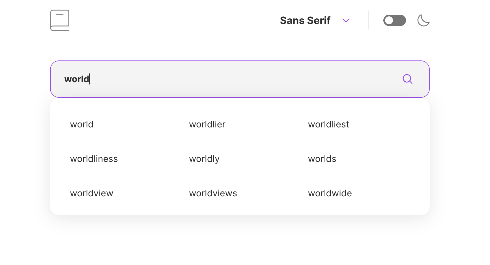

# Interactive Dictionary

This is a responsive, accessible dictionary application built with React. Users can search for words and receive definitions, phonetics, and part of speech in real-time via API. Features include keyboard navigation, theme toggle, mobile optimizations, autocomplete with debounced search, and ARIA support for screen readers.

## Table of contents

- [Overview](#overview)
  - [The challenge](#the-challenge)
  - [Screenshot](#screenshot)
  - [Links](#links)
- [My process](#my-process)
  - [Built with](#built-with)
  - [What I learned](#what-i-learned)
  - [Continued development](#continued-development)
- [Author](#author)

## Overview

### The challenge

Users should be able to:

- Search for words using the input field
- While searching, see a list of suggestions (autocomplete) based on current search value
- See the Free Dictionary API's response for the searched word
- See a form validation message when trying to submit a blank input
- Play the audio file for a word when it's available
- Search a word's synonym
- Tab through the entire page + list of suggestions
- Switch between serif, sans serif, and monospace fonts
- Switch between light and dark themes
- View the optimal layout for the interface depending on their device's screen size
- See error handling and fallback UI for network issues or empty results
- See hover and focus states for all interactive elements on the page

### Screenshot

### Links

- Live Site URL: [https://erickson-dictionary-web-app.netlify.app/](https://erickson-dictionary-web-app.netlify.app/)

## My process

### Built with

- [React](https://react.dev/) - JavaScript library
- [Free Dictionary API](https://dictionaryapi.dev/) - Third-party API Integration
- [CSS Modules](https://github.com/css-modules/css-modules) - For styles
- Focus on accessibility
- Semantic HTML5 markup
- CSS custom properties
- CSS Grid
- Flexbox
- Mobile-first workflow

### What I learned

- Implemented search autocomplete with debouncing to optimize performance

### Continued development

- Plan to integrate GraphQL to fetch only relevant data from the dictionary API for improved performance
- Cache recent searches for faster load and offline support
- Add voice search support for improved usability
- Implement unit and integration tests for critical components
- Optimize mobile responsiveness and touch interactions
- Have the correct color scheme chosen for them based on their computer preferences. _Hint_: Research `prefers-color-scheme` in CSS.
- Refactor components into separate, modular components

## Author

- Website - [Zowie Erickson](https://github.com/zowieerickson)
- LinkedIn - [@zowieerickson](https://www.linkedin.com/in/zowieerickson/)